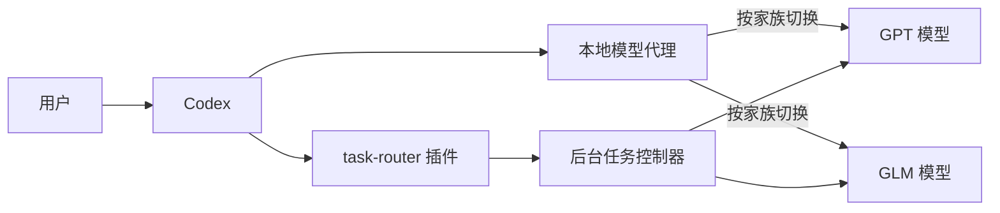

# task-router

[](https://github.com/BucherFeng/task-router/actions/workflows/ci.yml)
[](LICENSE)

Codex 多模型任务路由与故障恢复系统。在 Codex 对话中按任务类型分配模型，并通过本地代理在 GPT/GLM 家族之间切换，转发当前请求携带的对话内容与工具信息。



## 安装

### 完整安装（推荐）

```bash
git clone https://github.com/BucherFeng/task-router.git
cd task-router
./install.sh
```

完整安装包含 Codex 插件（对话工具、任务路由、后台执行）、本地模型代理（systemd 用户服务，自动故障切换）和个人配置文件。安装完成后新开一个 Codex 对话即可使用。

安装器读取你已有的 Codex provider 配置，保留 API 路径和密钥环境变量引用，先启动并验证代理，再切换本地地址。请使用当前普通用户执行，确保 `systemctl --user` 可用。默认预设适用于“503 表示 GPT 或 GLM 整类额度耗尽”的 Responses API 服务。

备用模型和本地端口可以在安装时指定：

```bash
./install.sh --proxy-port 8787 --glm-fallback gpt-6-astra --gpt-fallback glm-5.3
```

已有手动部署的代理时，用 `--upstream https://你的服务地址/v1` 指定原始 API 地址。升级时重新运行安装脚本，用户路由配置保持原样。完整安装会记录上游地址和配置备份位置。

### 通过 Codex 插件市场安装

```bash
codex plugin marketplace add https://github.com/BucherFeng/task-router.git
codex plugin add task-router@fengbochao-plugins
```

此方式安装插件功能；模型代理需按[模型代理文档](docs/model-proxy.md)单独配置。

### 验证

新开一个 Codex 对话，正常使用即可：

> 帮我分析这个项目的架构
> 修复 src/auth.py 里的登录 bug
> 审查一下最近的改动

Codex 加载 task-router 的工作流和工具后，会根据任务选择路由。也可以加上
"用 task-router" 前缀明确指定这套工作流。

或从终端运行：

```bash
codex plugin list --marketplace fengbochao-plugins --json
systemctl --user status task-router-proxy
```

## 能力

### 对话内任务管理

| 工具 | 能力 |
|---|---|
| `task_submit` | 在对话中提交后台任务，自动按类型分配模型 |
| `task_status` | 查询任务状态、列出最近任务、分页读取长结果 |
| `task_wait` | 有界等待任务完成 |
| `task_cancel` | 请求取消正在执行的任务 |
| `task_resume` | 恢复保存的可重试任务 |
| `router_diagnose` | 检查配置来源、模型分工和候选选择原因 |

### 按任务类型路由模型

| 任务类型 | 默认首选 | 候选链 |
|---|---|---|
| 普通讨论 | gpt-5.5 | gpt-5.6-sol → glm-5.3 |
| 方案规划、深度分析 | gpt-6-astra | gpt-5.6-sol → glm-5.3 |
| 代码审查 | glm-5.3 | glm-5.2 → glm-5.3-flash |
| 编码、重构、测试 | glm-5.3 | glm-5.2 → glm-5.3-flash |
| 读代码、机械小改 | glm-5.3 | glm-5.2 → glm-5.3-flash |

在 `~/.config/task-router/routing.json` 中修改模型 ID、启用状态或候选顺序即可调整分工。详见[配置参考](plugins/task-router/skills/task-router/references/routing-schema.md)。

### 家族级故障切换

本地模型代理运行在 Codex 与 API 之间：

- 对配置为家族额度信号的 HTTP 503，代理将该类加入冷却，并使用另一类的首选模型重试尚未输出的请求。
- 429 限流透传，Codex 按内建退避机制重试。
- 检测到上游读取异常时，代理将该类短冷却，后续重试请求可选择另一类。
- 冷却状态持久化，代理重启后保留。
- 切换时添加 `X-Task-Router-Failover` 响应头并记录所选目标模型，便于确认路由。

运维命令：

```bash
systemctl --user status task-router-proxy
tail -f ~/.local/state/task-router/proxy-access.jsonl
cat ~/.local/state/task-router/proxy-state.json
```

### 后台任务持久化

任务和执行记录存储在 SQLite 中，进程重启后可查询和恢复。相同请求键的任务自动去重，已完成的任务再次恢复只返回结果。文件变化在每次尝试前后保存摘要，续做任务基于实际文件状态。尝试次数和时间预算由程序管理，跨进程重启保留。

## 环境要求

| 组件 | 要求 |
|---|---|
| Python | 3.11+ |
| Codex CLI | 支持 plugin、MCP 和 app-server；本机验证版本 0.154.0 / 0.155.0 |
| 操作系统 | Linux，已启动的 systemd 用户服务会话 |
| API | 已配置的 Responses API provider，提供对应模型 ID 与有效凭据 |

缺少 MCP SDK 时，插件自动在私有环境安装 `mcp==1.27.0`。

## 配置

个人配置位于 `~/.config/task-router/routing.json`，升级时自动保留。可调整模型 ID、启用状态、推理档位、候选顺序和任务到角色的映射。新提交任务读取更新后的配置；已提交任务使用保存时的策略。

## 文档

- [配置参考](plugins/task-router/skills/task-router/references/routing-schema.md)
- [模型代理](docs/model-proxy.md)
- [候选模型验证](docs/model-check-20260914.md)
- [控制器架构](docs/controller-design.md)
- [CONTRIBUTING](CONTRIBUTING.md)
- [CHANGELOG](CHANGELOG.md)

## License

[MIT](LICENSE)
