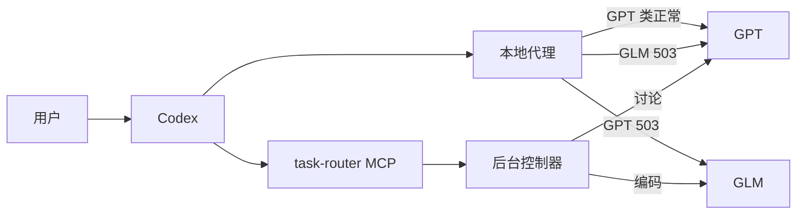

# task-router

[](https://github.com/fengbochao/task-router/actions/workflows/ci.yml)
[](LICENSE)
[](CHANGELOG.md)
[](tests/)

Codex 多模型任务路由与故障恢复插件。当 GPT 或 GLM 任一类模型额度耗尽时，自动切换到另一类继续服务，主对话上下文不丢失。



## Quick Start

### 方式一：Codex 插件安装（推荐）

```bash
codex plugin marketplace add https://github.com/fengbochao/task-router.git
codex plugin add task-router@fengbochao-plugins
```

安装后新开一个 Codex 对话即可使用。

### 方式二：完整安装（含模型代理）

```bash
git clone https://github.com/fengbochao/task-router.git ~/task-router
cd ~/task-router && ./install.sh
```

这会同时安装插件和可选的模型代理服务（systemd 用户服务）。

### 验证安装

在 Codex 对话中说：

```text
用 task-router 诊断一下配置
```

或者从终端运行：

```bash
codex plugin list --marketplace fengbochao-plugins --json
```

## 功能

| 功能 | 状态 | 说明 |
|---|---|---|
| 对话内任务提交 | ✅ | 通过 MCP 工具，无需终端命令 |
| 按任务类型路由模型 | ✅ | 讨论优先 GPT，编码优先 GLM |
| 家族级故障切换 | ✅ | 503 = 整类额度耗尽，自动切另一类 |
| 主模型无感恢复 | ✅ | 代理透明改写，上下文完整保留 |
| 后台任务持久化 | ✅ | SQLite 存储，进程重启不丢 |
| 模型身份提示 | ✅ | 切换后模型如实报告实际身份 |
| 流式中断收敛 | ✅ | 短冷却 + Codex 内建重试 |
| 429 限流处理 | ✅ | 透传不冷却，Codex 自动退避 |

## 模型分工

| 任务类型 | 默认首选 | 备选链 |
|---|---|---|
| 普通讨论 | gpt-5.5 | gpt-5.6-sol → glm-5.3 |
| 方案规划、深度分析 | gpt-6-astra | gpt-5.6-sol → glm-5.3 |
| 代码审查 | glm-5.3 | glm-5.2 → glm-5.3-flash |
| 编码、重构、测试 | glm-5.3 | glm-5.2 → glm-5.3-flash |
| 读代码、机械小改 | glm-5.3 | glm-5.2 → glm-5.3-flash |

修改 `~/.config/task-router/routing.json` 即可调整分工，无需改代码。详见[配置参考](plugins/task-router/skills/task-router/references/routing-schema.md)。

## 使用方式

安装并新开对话后，直接说：

- "用 task-router 分析这个项目的架构，先不要改代码。"
- "用 task-router 修复这个函数，并运行相关测试。"
- "刚才的任务做到哪了？"
- "取消任务" / "继续之前的任务"

内置工具：

| 工具 | 作用 |
|---|---|
| `task_submit` | 提交并启动后台任务 |
| `task_status` | 查询状态、分页读取长结果 |
| `task_wait` | 有界等待完成 |
| `task_cancel` | 请求取消 |
| `task_resume` | 恢复可重试任务 |
| `router_diagnose` | 诊断配置和模型选择 |

## 环境要求

| 组件 | 最低版本 | 说明 |
|---|---|---|
| Python | 3.11 | 标准库实现，无额外依赖 |
| Codex CLI | 0.154.0 | 需要 app-server 和 plugin 支持 |
| OS | Linux | 当前唯一验证平台 |
| API | OpenAI 兼容 | 需要 GPT 和 GLM 两类模型 |

缺少 MCP SDK 时，插件自动在私有环境安装 `mcp==1.27.0`，不影响全局 Python。

## 模型代理（可选但推荐）

代理运行在 Codex 与 API 之间，是解决主模型 503 的关键层：

```bash
# 查看状态
systemctl --user status task-router-proxy

# 查看实时路由日志
tail -f ~/.local/state/task-router/proxy-access.jsonl

# 查看冷却状态
cat ~/.local/state/task-router/proxy-state.json
```

| 故障类型 | 代理行为 |
|---|---|
| 503（额度耗尽） | 冷却该类 600s，立即切另一类 |
| 429（限流） | 透传，Codex 自动退避重试 |
| 流式中断 | 冷却该类 120s，Codex 重试时自动切换 |
| 两类同时耗尽 | 返回真实错误，等待恢复 |

详细说明见[模型代理文档](docs/model-proxy.md)。

## 故障排查

| 症状 | 检查 | 解决 |
|---|---|---|
| 模型自称不是你选的 | `tail -1 proxy-access.jsonl` | 这是代理切换，`model_out` 是实际模型 |
| 503 反复出现 | `cat proxy-state.json` | 检查是否两类同时冷却 |
| 工具未加载 | 新开对话 | 安装/升级后必须新开线程 |
| MCP 启动失败 | `codex plugin list` | 确认插件已启用；检查 Python 版本 |

## 开发

```bash
git clone https://github.com/fengbochao/task-router.git
cd task-router
python3 -B -m unittest discover -s tests -q
```

详见 [CONTRIBUTING.md](CONTRIBUTING.md)。

## 文档

- [模型代理](docs/model-proxy.md) - 故障切换原理和运维命令
- [对话入口验证](docs/v0.5-validation.md) - v0.5 完整测试记录
- [候选模型验证](docs/model-check-20260914.md) - 7 个模型实测结果
- [控制器设计](docs/controller-design.md) - 架构决策记录
- [配置参考](plugins/task-router/skills/task-router/references/routing-schema.md)

## License

[MIT](LICENSE)
